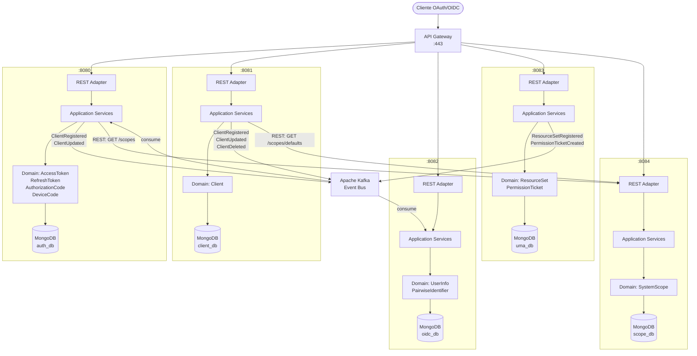
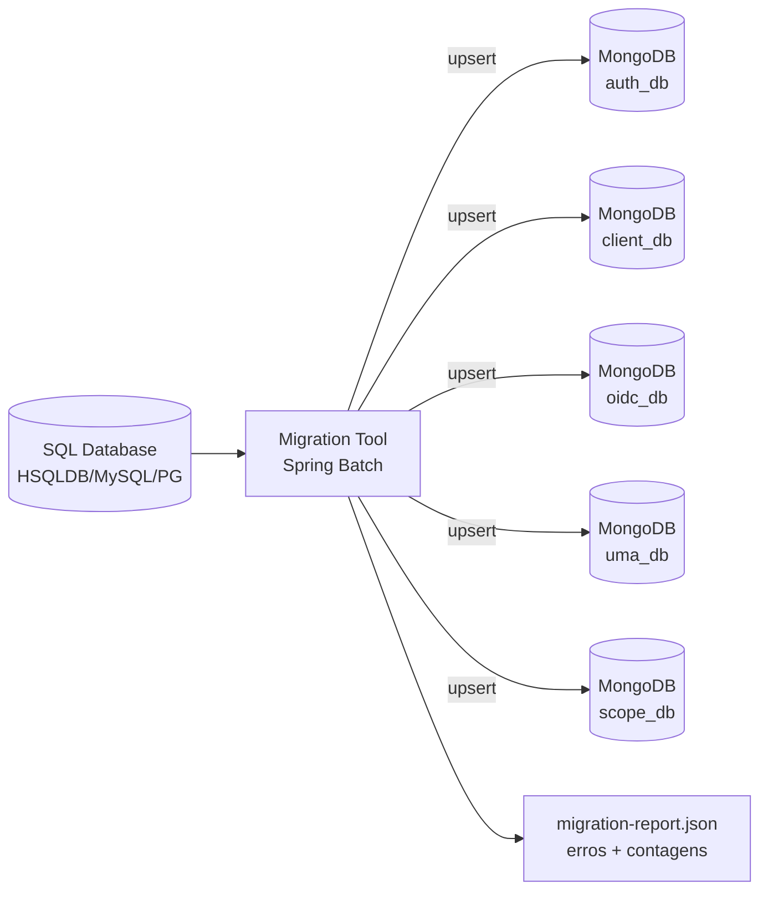

# Design Técnico — OIDC Microservices DDD Hexagonal

## Visão Geral

Este documento descreve o design técnico para a refatoração do MITREid Connect — monolito Spring MVC + JPA — em microserviços independentes com Domain-Driven Design (DDD), arquitetura hexagonal (Ports & Adapters) e persistência MongoDB.

O sistema é decomposto em cinco Bounded Contexts autônomos, cada um implantável como microserviço Spring Boot 3 independente com seu próprio banco MongoDB. A comunicação entre serviços usa REST síncrono para consultas em tempo real e Kafka para Domain Events assíncronos.

### Bounded Contexts e Microserviços

| Microserviço | Porta | Responsabilidade |
|---|---|---|
| `authorization-server` | 8080 | Fluxos OAuth 2.0, emissão/revogação de tokens, introspection |
| `client-registry` | 8081 | Registro dinâmico de clientes (RFC 7591/7592) |
| `oidc-provider` | 8082 | UserInfo, ID Token, Discovery, JWKS, Pairwise, Logout |
| `uma-server` | 8083 | UMA 2.0: ResourceSet, PermissionTicket, RPT |
| `scope-manager` | 8084 | Gerenciamento de SystemScopes |

Um **API Gateway** (ex.: Spring Cloud Gateway) roteia as URLs públicas do monolito original para os microserviços correspondentes, garantindo compatibilidade retroativa.


## Arquitetura

### Diagrama de Microserviços



### Roteamento do API Gateway

| URL Pública | Microserviço Destino |
|---|---|
| `/authorize`, `/token`, `/revoke`, `/introspect`, `/device_authorization` | `authorization-server` |
| `/register`, `/register/{id}` | `client-registry` |
| `/userinfo`, `/.well-known/openid-configuration`, `/jwks`, `/end_session` | `oidc-provider` |
| `/uma/resource_set/**`, `/uma/permission` | `uma-server` |


## Componentes e Interfaces

### Estrutura de Pacotes Hexagonal (padrão por microserviço)

Cada microserviço segue a mesma estrutura de pacotes. Exemplo para `authorization-server`:

```
authorization-server/
└── src/main/java/org/mitre/authserver/
    ├── domain/
    │   ├── model/                  # Aggregates, Value Objects, Domain Events
    │   │   ├── AccessToken.java    # Aggregate Root
    │   │   ├── RefreshToken.java   # Aggregate Root
    │   │   ├── AuthorizationCode.java
    │   │   ├── DeviceCode.java
    │   │   └── vo/                 # Value Objects (imutáveis, sem framework)
    │   │       ├── TokenValue.java
    │   │       ├── ClientId.java
    │   │       ├── CodeValue.java
    │   │       ├── AuthenticationHolder.java
    │   │       └── Scope.java
    │   ├── event/                  # Domain Events
    │   │   ├── AccessTokenIssued.java
    │   │   ├── AccessTokenRevoked.java
    │   │   ├── RefreshTokenIssued.java
    │   │   └── RefreshTokenRevoked.java
    │   ├── exception/              # Exceções de domínio tipadas
    │   │   ├── InvalidGrantException.java
    │   │   ├── TokenExpiredException.java
    │   │   └── AuthorizationCodeReusedException.java
    │   └── port/
    │       ├── in/                 # Driving Ports (Use Case interfaces)
    │       │   ├── IssueTokenUseCase.java
    │       │   ├── RevokeTokenUseCase.java
    │       │   └── IntrospectTokenUseCase.java
    │       └── out/                # Driven Ports (Repository/Event interfaces)
    │           ├── AccessTokenRepository.java
    │           ├── RefreshTokenRepository.java
    │           ├── AuthorizationCodeRepository.java
    │           ├── DeviceCodeRepository.java
    │           ├── ClientQueryPort.java     # consulta client-registry via REST
    │           ├── ScopeQueryPort.java      # consulta scope-manager via REST
    │           └── DomainEventPublisher.java
    ├── application/
    │   └── service/                # Application Services (implementam Driving Ports)
    │       ├── TokenIssuanceService.java
    │       ├── TokenRevocationService.java
    │       └── TokenIntrospectionService.java
    └── infrastructure/
        ├── adapter/
        │   ├── in/
        │   │   └── web/            # REST Controllers (Spring MVC)
        │   │       ├── AuthorizationEndpoint.java
        │   │       ├── TokenEndpoint.java
        │   │       ├── RevocationEndpoint.java
        │   │       └── IntrospectionEndpoint.java
        │   └── out/
        │       ├── persistence/    # MongoDB Repositories (Spring Data)
        │       │   ├── MongoAccessTokenRepository.java
        │       │   ├── MongoRefreshTokenRepository.java
        │       │   ├── MongoAuthorizationCodeRepository.java
        │       │   └── MongoDeviceCodeRepository.java
        │       ├── rest/           # REST clients para outros serviços
        │       │   ├── ClientRegistryRestAdapter.java
        │       │   └── ScopeManagerRestAdapter.java
        │       └── messaging/      # Kafka producers/consumers
        │           └── KafkaDomainEventPublisher.java
        └── config/
            ├── MongoConfig.java
            ├── SecurityConfig.java
            └── KafkaConfig.java
```

A mesma estrutura se repete para `client-registry`, `oidc-provider`, `uma-server` e `scope-manager`, substituindo os Aggregates e Ports correspondentes.


## Modelos de Dados

### Modelagem DDD por Bounded Context

#### Bounded Context: `authorization-server`

**Aggregate: `AccessToken`** (Aggregate Root)
- Value Objects: `TokenValue` (JWT string imutável), `ClientId`, `Subject`, `Scope`, `AuthenticationHolder`
- Entidades internas: `Permission` (para RPT UMA)
- Invariantes: `expiration` não pode ser nula; `clientId` deve referenciar cliente existente; token não pode ser emitido para cliente revogado.
- Domain Events: `AccessTokenIssued`, `AccessTokenRevoked`

**Aggregate: `RefreshToken`** (Aggregate Root)
- Value Objects: `TokenValue`, `ClientId`, `AuthenticationHolder`
- Invariantes: só pode existir se o cliente tiver `grant_type=refresh_token`; invalidado após uso (a menos que `reuseRefreshToken=true`)
- Domain Events: `RefreshTokenIssued`, `RefreshTokenRevoked`

**Aggregate: `AuthorizationCode`**
- Value Objects: `CodeValue`, `AuthenticationHolder`, `PKCEChallenge`
- Invariantes: uso único — após consumo, `used=true`; reutilização dispara revogação de todos os tokens associados

**Aggregate: `DeviceCode`**
- Value Objects: `DeviceCodeValue`, `UserCode`, `Scope`, `ClientId`
- Estado: `PENDING | APPROVED | DENIED | EXPIRED`

---

#### Bounded Context: `client-registry`

**Aggregate: `Client`** (Aggregate Root)
- Value Objects: `ClientId`, `ClientSecret`, `RedirectUri`, `GrantType`, `ResponseType`, `JwsAlgorithm`, `JweAlgorithm`, `SectorIdentifierUri`
- Invariantes: `grant_types` e `response_types` devem ser compatíveis; `redirect_uris` HTTPS para clientes web; `idTokenValiditySeconds` não pode ser nulo (default 600)
- Domain Events: `ClientRegistered`, `ClientUpdated`, `ClientDeleted`

---

#### Bounded Context: `oidc-provider`

**Aggregate: `UserInfo`** (Aggregate Root)
- Value Objects: `Subject`, `Address` (embutido: formatted, streetAddress, locality, region, postalCode, country)
- Campos: sub, preferredUsername, name, givenName, familyName, email, emailVerified, phoneNumber, gender, zoneinfo, locale, birthdate, updatedTime

**Aggregate: `PairwiseIdentifier`**
- Value Objects: `UserSub`, `SectorIdentifier`, `PairwiseValue`
- Invariante: par `(userSub, sectorIdentifier)` é único

---

#### Bounded Context: `uma-server`

**Aggregate: `ResourceSet`** (Aggregate Root)
- Entidades internas: `Policy` (com `claimsRequired: List<Claim>`, `scopes: Set<String>`)
- Value Objects: `ResourceSetId`, `Owner`, `ClientId`
- Domain Events: `ResourceSetRegistered`, `ResourceSetDeleted`

**Aggregate: `PermissionTicket`** (Aggregate Root)
- Value Objects: `TicketValue`, `Permission` (resourceSetId + scopes), `ClaimsSupplied`
- Invariante: expira após TTL configurado
- Domain Events: `PermissionTicketCreated`

---

#### Bounded Context: `scope-manager`

**Aggregate: `SystemScope`** (Aggregate Root)
- Value Objects: `ScopeValue` (único no sistema)
- Campos: value, description, icon, defaultScope, restricted

---

### Modelo de Dados MongoDB

#### Coleção `access_tokens` (authorization-server)

```json
{
  "_id": "uuid-v4",
  "tokenValue": "eyJhbGciOiJSUzI1NiJ9...",
  "clientId": "my-client",
  "expiration": ISODate("2024-12-31T23:59:59Z"),
  "tokenType": "Bearer",
  "scope": ["openid", "profile"],
  "refreshTokenId": "uuid-refresh",
  "approvedSiteId": "uuid-site",
  "authenticationHolder": {
    "clientId": "my-client",
    "userSub": "user-123",
    "approved": true,
    "redirectUri": "https://app.example.com/callback",
    "scope": ["openid", "profile"],
    "responseTypes": ["code"],
    "requestParameters": { "nonce": "abc123" },
    "authorities": ["ROLE_USER"],
    "userAuth": {
      "name": "user-123",
      "authenticated": true,
      "authorities": ["ROLE_USER"]
    }
  },
  "permissions": [
    { "resourceSetId": "rs-uuid", "scopes": ["read"] }
  ],
  "version": 1
}
```

Índices:
- `{ expiration: 1 }` — TTL index, `expireAfterSeconds: 0`
- `{ clientId: 1 }`
- `{ "authenticationHolder.userSub": 1 }`
- `{ refreshTokenId: 1 }`
- `{ approvedSiteId: 1 }`

---

#### Coleção `refresh_tokens` (authorization-server)

```json
{
  "_id": "uuid-v4",
  "tokenValue": "eyJhbGciOiJSUzI1NiJ9...",
  "clientId": "my-client",
  "expiration": ISODate("2025-06-30T00:00:00Z"),
  "authenticationHolder": { /* mesmo subdocumento de access_tokens */ },
  "version": 1
}
```

Índices:
- `{ expiration: 1 }` — TTL index
- `{ clientId: 1 }`
- `{ "authenticationHolder.userSub": 1 }`

---

#### Coleção `authorization_codes` (authorization-server)

```json
{
  "_id": "uuid-v4",
  "code": "SplxlOBeZQQYbYS6WxSbIA",
  "expiration": ISODate("2024-01-01T00:05:00Z"),
  "used": false,
  "pkceChallenge": "E9Melhoa2OwvFrEMTJguCHaoeK1t8URWbuGJSstw-cM",
  "pkceChallengeMethod": "S256",
  "authenticationHolder": { /* subdocumento */ },
  "version": 1
}
```

Índices:
- `{ code: 1 }` — unique
- `{ expiration: 1 }` — TTL index

---

#### Coleção `device_codes` (authorization-server)

```json
{
  "_id": "uuid-v4",
  "deviceCode": "GmRhmhcxhwAzkoEqiMEg_DnyEysNkuNhszIySk9eS",
  "userCode": "WDJB-MJHT",
  "clientId": "my-client",
  "scope": ["openid"],
  "expiration": ISODate("2024-01-01T00:10:00Z"),
  "status": "PENDING",
  "requestParameters": { "response_type": "device_code" },
  "authenticationHolder": null,
  "version": 1
}
```

Índices:
- `{ userCode: 1 }` — unique
- `{ deviceCode: 1 }`
- `{ expiration: 1 }` — TTL index

---

#### Coleção `clients` (client-registry)

```json
{
  "_id": "my-client",
  "clientId": "my-client",
  "clientSecret": "$2a$10$...",
  "clientName": "My Application",
  "clientDescription": "...",
  "clientUri": "https://app.example.com",
  "logoUri": "https://app.example.com/logo.png",
  "tosUri": "https://app.example.com/tos",
  "policyUri": "https://app.example.com/privacy",
  "redirectUris": ["https://app.example.com/callback"],
  "postLogoutRedirectUris": ["https://app.example.com/logout"],
  "contacts": ["admin@example.com"],
  "scope": ["openid", "profile", "email"],
  "grantTypes": ["authorization_code", "refresh_token"],
  "responseTypes": ["code"],
  "tokenEndpointAuthMethod": "SECRET_BASIC",
  "applicationType": "WEB",
  "subjectType": "PUBLIC",
  "sectorIdentifierUri": null,
  "jwksUri": null,
  "jwks": null,
  "idTokenSignedResponseAlg": "RS256",
  "idTokenEncryptedResponseAlg": null,
  "idTokenEncryptedResponseEnc": null,
  "userInfoSignedResponseAlg": null,
  "userInfoEncryptedResponseAlg": null,
  "userInfoEncryptedResponseEnc": null,
  "requestObjectSigningAlg": null,
  "tokenEndpointAuthSigningAlg": null,
  "defaultMaxAge": null,
  "requireAuthTime": false,
  "defaultACRvalues": [],
  "requestUris": [],
  "claimsRedirectUris": [],
  "accessTokenValiditySeconds": 3600,
  "refreshTokenValiditySeconds": 86400,
  "idTokenValiditySeconds": 600,
  "deviceCodeValiditySeconds": 600,
  "reuseRefreshToken": true,
  "clearAccessTokensOnRefresh": true,
  "dynamicallyRegistered": true,
  "allowIntrospection": false,
  "softwareId": null,
  "softwareVersion": null,
  "softwareStatement": null,
  "codeChallengeMethod": null,
  "authorities": ["ROLE_CLIENT"],
  "resourceIds": [],
  "createdAt": ISODate("2024-01-01T00:00:00Z"),
  "version": 1
}
```

Índices:
- `{ clientId: 1 }` — unique

---

#### Coleção `user_info` (oidc-provider)

```json
{
  "_id": "user-123",
  "sub": "user-123",
  "preferredUsername": "jdoe",
  "name": "John Doe",
  "givenName": "John",
  "familyName": "Doe",
  "middleName": null,
  "nickname": "johnny",
  "email": "jdoe@example.com",
  "emailVerified": true,
  "phoneNumber": "+1-555-0100",
  "phoneNumberVerified": false,
  "gender": "male",
  "birthdate": "1990-01-15",
  "zoneinfo": "America/New_York",
  "locale": "en-US",
  "updatedTime": "1704067200",
  "profile": "https://example.com/jdoe",
  "picture": "https://example.com/jdoe.jpg",
  "website": "https://jdoe.example.com",
  "address": {
    "formatted": "123 Main St, Springfield, IL 62701",
    "streetAddress": "123 Main St",
    "locality": "Springfield",
    "region": "IL",
    "postalCode": "62701",
    "country": "US"
  },
  "version": 1
}
```

Índices:
- `{ preferredUsername: 1 }` — unique
- `{ email: 1 }`

---

#### Coleção `pairwise_identifiers` (oidc-provider)

```json
{
  "_id": "uuid-v4",
  "userSub": "user-123",
  "sectorIdentifier": "https://app.example.com",
  "identifier": "pairwise-opaque-value-xyz"
}
```

Índices:
- `{ userSub: 1, sectorIdentifier: 1 }` — unique compound

---

#### Coleção `approved_sites` (oidc-provider ou site-policy)

```json
{
  "_id": "uuid-v4",
  "userId": "user-123",
  "clientId": "my-client",
  "creationDate": ISODate("2024-01-01T00:00:00Z"),
  "accessDate": ISODate("2024-06-01T12:00:00Z"),
  "timeoutDate": null,
  "allowedScopes": ["openid", "profile"],
  "version": 1
}
```

Índices:
- `{ userId: 1, clientId: 1 }` — compound
- `{ clientId: 1 }`

---

#### Coleção `whitelisted_sites` (oidc-provider ou site-policy)

```json
{
  "_id": "uuid-v4",
  "creatorUserId": "admin",
  "clientId": "trusted-client",
  "allowedScopes": ["openid", "profile"]
}
```

Índices:
- `{ clientId: 1 }`

---

#### Coleção `blacklisted_sites` (oidc-provider ou site-policy)

```json
{
  "_id": "uuid-v4",
  "uri": "https://malicious.example.com"
}
```

---

#### Coleção `resource_sets` (uma-server)

```json
{
  "_id": "rs-uuid",
  "name": "My Photos",
  "uri": "https://photos.example.com/album/1",
  "type": "http://www.example.com/rsrcs/photoalbum",
  "scopes": ["read", "write"],
  "iconUri": "https://photos.example.com/icon.png",
  "owner": "user-123",
  "clientId": "photo-app",
  "policies": [
    {
      "name": "Friends only",
      "scopes": ["read"],
      "claimsRequired": [
        {
          "name": "group",
          "friendlyName": "Group Membership",
          "claimType": "string",
          "value": "friends",
          "claimTokenFormat": ["http://openid.net/specs/openid-connect-core-1_0.html#IDToken"],
          "issuer": ["https://idp.example.com"]
        }
      ]
    }
  ],
  "version": 1
}
```

Índices:
- `{ owner: 1 }`
- `{ owner: 1, clientId: 1 }` — compound
- `{ clientId: 1 }`

---

#### Coleção `permission_tickets` (uma-server)

```json
{
  "_id": "uuid-v4",
  "ticket": "016f84e8-f9b9-11e0-bd6f-0021cc6004de",
  "expiration": ISODate("2024-01-01T00:05:00Z"),
  "permission": {
    "resourceSetId": "rs-uuid",
    "scopes": ["read"]
  },
  "claimsSupplied": [
    {
      "name": "email",
      "claimType": "string",
      "value": "user@example.com",
      "claimTokenFormat": ["http://openid.net/specs/openid-connect-core-1_0.html#IDToken"],
      "issuer": ["https://idp.example.com"]
    }
  ],
  "version": 1
}
```

Índices:
- `{ ticket: 1 }` — unique
- `{ expiration: 1 }` — TTL index

---

#### Coleção `system_scopes` (scope-manager)

```json
{
  "_id": "openid",
  "value": "openid",
  "description": "OpenID Connect scope",
  "icon": "user",
  "defaultScope": true,
  "restricted": false,
  "version": 1
}
```

Índices:
- `{ value: 1 }` — unique


## Contratos de API REST

### `authorization-server`

| Método | Endpoint | Descrição |
|---|---|---|
| GET/POST | `/authorize` | Inicia Authorization Code / Implicit flow |
| POST | `/token` | Emite tokens (authorization_code, client_credentials, refresh_token, device_code, uma-ticket) |
| POST | `/revoke` | Revoga access ou refresh token |
| POST | `/introspect` | Retorna metadados do token (RFC 7662) |
| POST | `/device_authorization` | Inicia Device Authorization Flow (RFC 8628) |

**POST /token — request (authorization_code)**
```
grant_type=authorization_code
&code=SplxlOBeZQQYbYS6WxSbIA
&redirect_uri=https%3A%2F%2Fapp.example.com%2Fcallback
&client_id=my-client
&code_verifier=dBjftJeZ4CVP-mB92K27uhbUJU1p1r_wW1gFWFOEjXk  (PKCE)
```

**POST /token — response**
```json
{
  "access_token": "eyJhbGciOiJSUzI1NiJ9...",
  "token_type": "Bearer",
  "expires_in": 3600,
  "refresh_token": "eyJhbGciOiJSUzI1NiJ9...",
  "scope": "openid profile",
  "id_token": "eyJhbGciOiJSUzI1NiJ9..."
}
```

**POST /introspect — response**
```json
{
  "active": true,
  "sub": "user-123",
  "client_id": "my-client",
  "scope": "openid profile",
  "exp": 1735689599,
  "iat": 1735686000,
  "token_type": "Bearer"
}
```

---

### `client-registry`

| Método | Endpoint | Descrição |
|---|---|---|
| POST | `/register` | Registra novo cliente (RFC 7591) |
| GET | `/register/{client_id}` | Retorna metadados do cliente |
| PUT | `/register/{client_id}` | Atualiza metadados do cliente |
| DELETE | `/register/{client_id}` | Remove cliente |

**POST /register — request body**
```json
{
  "client_name": "My Application",
  "redirect_uris": ["https://app.example.com/callback"],
  "grant_types": ["authorization_code", "refresh_token"],
  "response_types": ["code"],
  "token_endpoint_auth_method": "client_secret_basic",
  "scope": "openid profile email",
  "subject_type": "public",
  "id_token_signed_response_alg": "RS256"
}
```

**POST /register — response (201)**
```json
{
  "client_id": "generated-client-id",
  "client_secret": "generated-secret",
  "client_id_issued_at": 1704067200,
  "client_secret_expires_at": 0,
  "registration_access_token": "rat-token-value",
  "registration_client_uri": "https://server.example.com/register/generated-client-id",
  "client_name": "My Application",
  "redirect_uris": ["https://app.example.com/callback"],
  "grant_types": ["authorization_code", "refresh_token"],
  "response_types": ["code"],
  "scope": "openid profile email"
}
```

---

### `oidc-provider`

| Método | Endpoint | Descrição |
|---|---|---|
| GET/POST | `/userinfo` | Retorna claims do usuário autenticado |
| GET | `/.well-known/openid-configuration` | Discovery document |
| GET | `/jwks` | JSON Web Key Set público |
| GET/POST | `/end_session` | RP-Initiated Logout |

**GET /.well-known/openid-configuration — response (fragmento)**
```json
{
  "issuer": "https://server.example.com",
  "authorization_endpoint": "https://server.example.com/authorize",
  "token_endpoint": "https://server.example.com/token",
  "userinfo_endpoint": "https://server.example.com/userinfo",
  "jwks_uri": "https://server.example.com/jwks",
  "registration_endpoint": "https://server.example.com/register",
  "scopes_supported": ["openid", "profile", "email", "address", "phone"],
  "response_types_supported": ["code", "token", "id_token", "code token"],
  "grant_types_supported": ["authorization_code", "implicit", "refresh_token", "client_credentials", "urn:ietf:params:oauth:grant-type:device_code"],
  "subject_types_supported": ["public", "pairwise"],
  "id_token_signing_alg_values_supported": ["RS256", "RS384", "RS512", "ES256", "ES384", "ES512", "PS256"],
  "token_endpoint_auth_methods_supported": ["client_secret_basic", "client_secret_post", "private_key_jwt", "none"]
}
```

---

### `uma-server`

| Método | Endpoint | Descrição |
|---|---|---|
| POST | `/uma/resource_set` | Registra ResourceSet |
| GET | `/uma/resource_set/{id}` | Retorna ResourceSet |
| PUT | `/uma/resource_set/{id}` | Atualiza ResourceSet |
| DELETE | `/uma/resource_set/{id}` | Remove ResourceSet |
| GET | `/uma/resource_set` | Lista ResourceSets do owner |
| POST | `/uma/permission` | Cria PermissionTicket |

**POST /uma/resource_set — request body**
```json
{
  "name": "My Photos",
  "uri": "https://photos.example.com/album/1",
  "type": "http://www.example.com/rsrcs/photoalbum",
  "resource_scopes": ["read", "write"],
  "icon_uri": "https://photos.example.com/icon.png"
}
```

**POST /uma/permission — request body**
```json
{
  "resource_id": "rs-uuid",
  "resource_scopes": ["read"]
}
```

**POST /uma/permission — response (201)**
```json
{
  "ticket": "016f84e8-f9b9-11e0-bd6f-0021cc6004de"
}
```

---

### `scope-manager`

| Método | Endpoint | Descrição |
|---|---|---|
| GET | `/scopes` | Lista todos os SystemScopes |
| GET | `/scopes/defaults` | Lista escopos com defaultScope=true |
| POST | `/scopes` | Cria novo SystemScope (admin) |
| PUT | `/scopes/{value}` | Atualiza SystemScope |
| DELETE | `/scopes/{value}` | Remove SystemScope |


## Tecnologias e Stack

| Camada | Tecnologia | Justificativa |
|---|---|---|
| Runtime | Java 21 (LTS) | Records, sealed classes, virtual threads (Project Loom) |
| Framework | Spring Boot 3.3 | Auto-configuration, Actuator, nativo GraalVM |
| Web | Spring MVC (Servlet) | Compatibilidade com filtros Spring Security OAuth2 |
| Persistência | Spring Data MongoDB 4.x | Repositórios reativos opcionais, suporte a transações |
| Driver MongoDB | MongoDB Driver 5.x | Transações multi-documento, change streams |
| Segurança | Spring Security 6 | OAuth2 Resource Server, JWT decoder |
| JWT | Nimbus JOSE+JWT 9.x | Biblioteca já usada no monolito; suporte completo a JWS/JWE |
| Criptografia | Bouncy Castle 1.78 | Algoritmos EC, PS256 |
| Mensageria | Apache Kafka 3.x | At-least-once delivery, log compaction para eventos |
| Service Discovery | Spring Cloud Gateway | Roteamento, circuit breaker (Resilience4j) |
| Observabilidade | Micrometer + OpenTelemetry | Métricas Prometheus, tracing distribuído |
| Logs | Logback + Logstash encoder | JSON estruturado com traceId/spanId |
| Testes unitários | JUnit 5 + Mockito | Mocks dos Ports de saída |
| Testes de propriedade | jqwik 1.8 | Property-based testing para lógica de domínio |
| Testes de integração | Testcontainers + MongoDB | MongoDB real em container para testes de repositório |
| Build | Maven 3.9 (multi-module) | Consistência com o projeto legado |
| Containerização | Docker + Docker Compose | Orquestração local de todos os serviços |

### Dependências Maven principais (por microserviço)

```xml
<!-- Spring Boot 3 -->
<parent>
  <groupId>org.springframework.boot</groupId>
  <artifactId>spring-boot-starter-parent</artifactId>
  <version>3.3.0</version>
</parent>

<dependencies>
  <dependency>
    <groupId>org.springframework.boot</groupId>
    <artifactId>spring-boot-starter-web</artifactId>
  </dependency>
  <dependency>
    <groupId>org.springframework.boot</groupId>
    <artifactId>spring-boot-starter-data-mongodb</artifactId>
  </dependency>
  <dependency>
    <groupId>org.springframework.boot</groupId>
    <artifactId>spring-boot-starter-security</artifactId>
  </dependency>
  <dependency>
    <groupId>org.springframework.boot</groupId>
    <artifactId>spring-boot-starter-actuator</artifactId>
  </dependency>
  <dependency>
    <groupId>com.nimbusds</groupId>
    <artifactId>nimbus-jose-jwt</artifactId>
    <version>9.37.3</version>
  </dependency>
  <dependency>
    <groupId>org.springframework.kafka</groupId>
    <artifactId>spring-kafka</artifactId>
  </dependency>
  <dependency>
    <groupId>io.micrometer</groupId>
    <artifactId>micrometer-tracing-bridge-otel</artifactId>
  </dependency>
  <!-- Testes -->
  <dependency>
    <groupId>net.jqwik</groupId>
    <artifactId>jqwik</artifactId>
    <version>1.8.4</version>
    <scope>test</scope>
  </dependency>
  <dependency>
    <groupId>org.testcontainers</groupId>
    <artifactId>mongodb</artifactId>
    <scope>test</scope>
  </dependency>
</dependencies>
```


## Estratégia de Comunicação entre Serviços

### Chamadas Síncronas (REST)

Usadas quando o resultado é necessário imediatamente para completar a operação corrente.

| Chamador | Chamado | Endpoint | Quando |
|---|---|---|---|
| `authorization-server` | `client-registry` | `GET /register/{clientId}` | Validar cliente em qualquer fluxo de token |
| `authorization-server` | `scope-manager` | `GET /scopes` | Validar escopos solicitados |
| `authorization-server` | `oidc-provider` | `GET /userinfo/{sub}` | Incluir claims no ID Token |
| `client-registry` | `scope-manager` | `GET /scopes/defaults` | Atribuir escopos padrão ao registrar cliente |
| `oidc-provider` | `authorization-server` | `POST /introspect` | Validar access token no endpoint /userinfo |

Todas as chamadas REST entre serviços usam **mTLS** (certificados de cliente) para autenticação mútua. O API Gateway injeta o header `X-Service-Identity` com o nome do serviço chamador.

Circuit breakers (Resilience4j) protegem todas as chamadas síncronas. Em caso de falha do serviço chamado, o circuit breaker retorna resposta de fallback ou propaga HTTP 503.

### Chamadas Assíncronas (Kafka)

Usadas para notificar outros contextos sobre mudanças de estado, sem acoplamento temporal.

| Produtor | Tópico Kafka | Consumidores | Evento |
|---|---|---|---|
| `authorization-server` | `auth.token.issued` | `oidc-provider` (audit) | `AccessTokenIssued` |
| `authorization-server` | `auth.token.revoked` | `uma-server` (invalidar RPTs) | `AccessTokenRevoked` |
| `authorization-server` | `auth.refresh.issued` | — | `RefreshTokenIssued` |
| `authorization-server` | `auth.refresh.revoked` | — | `RefreshTokenRevoked` |
| `client-registry` | `client.registered` | `oidc-provider` (pairwise setup) | `ClientRegistered` |
| `client-registry` | `client.updated` | `authorization-server` (cache invalidation) | `ClientUpdated` |
| `client-registry` | `client.deleted` | `authorization-server`, `oidc-provider` | `ClientDeleted` |
| `uma-server` | `uma.resource.registered` | — | `ResourceSetRegistered` |
| `uma-server` | `uma.permission.created` | — | `PermissionTicketCreated` |

**Formato de envelope dos Domain Events:**
```json
{
  "eventId": "uuid-v4",
  "eventType": "AccessTokenIssued",
  "aggregateId": "token-uuid",
  "aggregateType": "AccessToken",
  "occurredAt": "2024-01-01T00:00:00Z",
  "serviceOrigin": "authorization-server",
  "traceId": "otel-trace-id",
  "payload": { /* campos específicos do evento */ }
}
```

**Dead Letter Queue:** Eventos que falham após 3 tentativas são enviados para o tópico `{original-topic}.DLT`. Um consumer separado processa a DLT para reprocessamento manual ou alertas.


## Considerações de Segurança

### Autenticação entre Microserviços

**mTLS (Mutual TLS):** Cada microserviço possui um certificado de cliente emitido por uma CA interna. Chamadas REST entre serviços exigem apresentação do certificado. O API Gateway valida o certificado do cliente externo e injeta headers de identidade para os serviços internos.

**Service Account Tokens:** Alternativamente (ou em conjunto com mTLS), cada serviço obtém um access token via `client_credentials` grant do próprio `authorization-server` para autenticar chamadas internas. O token é cacheado e renovado antes da expiração.

### Validação de Tokens

O `authorization-server` assina tokens com chaves RSA/EC armazenadas em um keystore seguro (ex.: HashiCorp Vault ou AWS KMS em produção; arquivo JWK em desenvolvimento). O `oidc-provider` expõe as chaves públicas via `/jwks`.

Qualquer microserviço que precise validar um access token de entrada usa o Spring Security OAuth2 Resource Server com configuração apontando para o JWKS URI do `oidc-provider`:

```yaml
spring:
  security:
    oauth2:
      resourceserver:
        jwt:
          jwk-set-uri: http://oidc-provider:8082/jwks
```

A validação local (sem chamada de rede) é preferida para access tokens JWT. O endpoint `/introspect` é usado apenas para tokens opacos ou quando a revogação em tempo real é crítica.

### Proteção de Endpoints

| Endpoint | Proteção |
|---|---|
| `/authorize` | Autenticação do usuário final (Spring Security form login / SSO) |
| `/token` | Autenticação do cliente (Basic Auth, client_secret_post, private_key_jwt) |
| `/introspect`, `/revoke` | Autenticação do cliente |
| `/userinfo` | Bearer token com escopo `openid` |
| `/register` (POST) | Aberto (Dynamic Registration) ou Bearer token de initial access |
| `/register/{id}` (GET/PUT/DELETE) | Registration Access Token |
| `/uma/resource_set/**` | Bearer token com escopo UMA |
| `/scopes` (POST/PUT/DELETE) | Bearer token com role `ROLE_ADMIN` |
| `/actuator/health` | Público (liveness/readiness) |
| `/actuator/metrics`, `/actuator/info` | Restrito a rede interna |

### Segredos e Chaves

- Segredos de clientes armazenados com hash BCrypt no MongoDB
- Chaves privadas JWK nunca expostas via API; apenas chaves públicas via `/jwks`
- Variáveis de ambiente para strings de conexão MongoDB e credenciais Kafka
- Rotação de chaves JWK suportada via múltiplas entradas no JWKS com `kid` distinto


## Estratégia de Migração de Dados

### Visão Geral

A migração é executada por uma ferramenta standalone (`migration-tool`) que lê do banco SQL legado e escreve nas coleções MongoDB dos microserviços. A ferramenta é idempotente: usa upsert com o identificador natural do Aggregate como `_id`.

### Mapeamento SQL → MongoDB

| Tabela SQL | Coleção MongoDB | Serviço | Observações |
|---|---|---|---|
| `client_details` + `client_scope` + `client_grant_type` + `client_redirect_uri` + ... | `clients` | `client-registry` | Todas as tabelas `@ElementCollection` viram arrays no documento |
| `access_token` + `token_scope` | `access_tokens` | `authorization-server` | `auth_holder_id` → subdocumento embutido |
| `refresh_token` | `refresh_tokens` | `authorization-server` | Idem |
| `authorization_code` | `authorization_codes` | `authorization-server` | |
| `device_code` + `device_code_scope` + `device_code_request_parameter` | `device_codes` | `authorization-server` | |
| `authentication_holder` + tabelas auxiliares | Embutido em tokens/codes | `authorization-server` | Desnormalizado como subdocumento |
| `user_info` + `address` | `user_info` | `oidc-provider` | `address` vira subdocumento |
| `pairwise_identifier` | `pairwise_identifiers` | `oidc-provider` | |
| `approved_site` + `approved_site_scope` | `approved_sites` | `oidc-provider` | |
| `whitelisted_site` + `whitelisted_site_scope` | `whitelisted_sites` | `oidc-provider` | |
| `blacklisted_site` | `blacklisted_sites` | `oidc-provider` | |
| `resource_set` + `resource_set_scope` + `policy` + `claim` | `resource_sets` | `uma-server` | Policies e Claims embutidos |
| `permission_ticket` + `permission` + `claim_to_permission_ticket` | `permission_tickets` | `uma-server` | Permission e Claims embutidos |
| `system_scope` | `system_scopes` | `scope-manager` | `value` vira `_id` |

### Processo de Migração



**Estratégia de execução:**
1. Migrar `system_scopes` primeiro (sem dependências)
2. Migrar `clients` (dependem de scopes)
3. Migrar `user_info`, `pairwise_identifiers`, `approved_sites`, `whitelisted_sites`, `blacklisted_sites`
4. Migrar `authentication_holders` (desnormalizados inline nos tokens)
5. Migrar `refresh_tokens`, `authorization_codes`, `device_codes`
6. Migrar `access_tokens` (dependem de refresh tokens)
7. Migrar `resource_sets` (com policies e claims embutidos)
8. Migrar `permission_tickets`

**Idempotência:** Cada documento é inserido via `replaceOne({ _id: <id> }, doc, { upsert: true })`. Executar múltiplas vezes produz o mesmo estado final.

**Tratamento de erros:** Registros com dados inconsistentes (ex.: `auth_holder_id` referenciando holder inexistente) são registrados em `migration-report.json` com o ID do registro e a causa do erro. A migração continua para os demais registros.

**Validação pós-migração:** A ferramenta compara contagens de registros SQL vs documentos MongoDB por coleção e registra discrepâncias no relatório.


## Tratamento de Erros

### Exceções de Domínio

Cada Bounded Context define suas próprias exceções de domínio tipadas no pacote `domain/exception`. Nenhuma exceção de domínio expõe detalhes de infraestrutura (stack traces MongoDB, mensagens JDBC, etc.).

```java
// Exemplos de exceções de domínio
public class InvalidGrantException extends DomainException { ... }
public class TokenExpiredException extends DomainException { ... }
public class AuthorizationCodeReusedException extends DomainException { ... }
public class ClientNotFoundException extends DomainException { ... }
public class InvalidScopeException extends DomainException { ... }
public class OptimisticLockingException extends DomainException { ... }
public class PermissionTicketExpiredException extends DomainException { ... }
```

### Mapeamento de Exceções para HTTP

Um `@ControllerAdvice` global em cada microserviço mapeia exceções de domínio para respostas HTTP conformes com RFC 6749 (OAuth 2.0 error responses):

| Exceção de Domínio | HTTP Status | `error` |
|---|---|---|
| `InvalidGrantException` | 400 | `invalid_grant` |
| `TokenExpiredException` | 401 | `invalid_token` |
| `AuthorizationCodeReusedException` | 400 | `invalid_grant` |
| `ClientNotFoundException` | 401 | `invalid_client` |
| `InvalidScopeException` | 400 | `invalid_scope` |
| `InvalidClientMetadataException` | 400 | `invalid_client_metadata` |
| `PermissionTicketExpiredException` | 400 | `expired_ticket` |
| `OptimisticLockingException` | 409 | `conflict` |
| Serviço dependente indisponível | 503 | `temporarily_unavailable` |

### Resiliência

- **Circuit Breaker (Resilience4j):** Todas as chamadas REST entre serviços têm circuit breaker com threshold de 50% de falhas em janela de 10 requisições.
- **Retry:** 3 tentativas com backoff exponencial para chamadas a `scope-manager` e `client-registry`.
- **Timeout:** 2 segundos para chamadas síncronas entre serviços.
- **Fallback:** Em caso de indisponibilidade do `scope-manager`, o `authorization-server` usa cache local de escopos (TTL 5 minutos).


## Correctness Properties

*A property is a characteristic or behavior that should hold true across all valid executions of a system — essentially, a formal statement about what the system should do. Properties serve as the bridge between human-readable specifications and machine-verifiable correctness guarantees.*

O prework de análise identificou as seguintes propriedades testáveis a partir dos critérios de aceitação. Propriedades redundantes foram consolidadas após reflexão.

**Reflexão sobre redundância:**
- As propriedades 5 (round-trip de serialização JWT) e 6 (parse de JWT inválido) são complementares e não redundantes: uma testa o caminho feliz, a outra o caminho de erro.
- As propriedades 3 (invariante de domínio) e 4 (optimistic locking) testam mecanismos de proteção distintos e não se sobrepõem.
- As propriedades 7 (refresh token invalidado após uso) e 8 (authorization code de uso único) testam Aggregates diferentes com invariantes similares mas independentes — mantidas separadas.

---

### Property 1: Round-trip de persistência de Aggregate

*For any* Aggregate Root válido (AccessToken, RefreshToken, Client, UserInfo, ResourceSet, SystemScope), persistir o Aggregate no MongoDB e recuperá-lo pelo seu identificador deve produzir um objeto com os mesmos campos e valores do original.

**Validates: Requirements 5.1**

---

### Property 2: Round-trip de serialização JWT

*For any* AccessToken ou RefreshToken válido com claims arbitrários, serializar o token para string JWT usando Nimbus JOSE+JWT e depois fazer o parse da string resultante deve produzir um objeto com claims equivalentes ao original (`parse(serialize(token)).claims == token.claims`).

**Validates: Requirements 11.4**

---

### Property 3: Invariantes de domínio lançam exceção tipada

*For any* operação que viole uma invariante de negócio de um Aggregate (ex.: emitir token para `clientId` inexistente, registrar cliente com `grant_types` incompatíveis com `response_types`, solicitar escopo `restricted` sem autorização), o Aggregate Root deve lançar uma exceção de domínio tipada que não expõe detalhes de infraestrutura.

**Validates: Requirements 3.12, 7.5, 10.5**

---

### Property 4: Conflito de versão lança exceção de concorrência tipada

*For any* Aggregate com campo `version` desatualizado (simulando escrita concorrente), uma tentativa de persistência deve lançar `OptimisticLockingException` tipada, sem corromper o estado do documento no MongoDB.

**Validates: Requirements 5.7**

---

### Property 5: Parse de JWT inválido retorna erro tipado

*For any* string que não seja um JWT válido (string vazia, JSON arbitrário, JWT com assinatura inválida, JWT com algoritmo `none`), o `TokenService` deve retornar um erro de parsing ou validação tipado sem lançar exceção não tratada (`NullPointerException`, `RuntimeException` genérica, etc.).

**Validates: Requirements 11.5, 11.6**

---

### Property 6: Refresh token é invalidado após uso

*For any* RefreshToken válido, após ser utilizado para emitir um novo AccessToken, o RefreshToken original deve estar marcado como inválido/revogado, de modo que uma segunda tentativa de uso do mesmo token retorne `invalid_grant`.

**Validates: Requirements 6.4**

---

### Property 7: Authorization code é de uso único

*For any* AuthorizationCode válido que já foi utilizado para emitir tokens, uma segunda tentativa de uso deve resultar em revogação de todos os tokens emitidos com base nesse código e retorno de `invalid_grant`.

**Validates: Requirements 6.9**

---

### Property 8: Pairwise identifier é determinístico

*For any* par `(userSub, sectorIdentifier)`, chamar a função de geração/recuperação de `PairwiseIdentifier` múltiplas vezes deve sempre retornar o mesmo valor de identificador pairwise — a função é idempotente para o mesmo par de entrada.

**Validates: Requirements 8.5**

---

### Property 9: Migração é idempotente

*For any* conjunto de registros SQL de entrada, executar a ferramenta de migração uma ou múltiplas vezes deve produzir exatamente o mesmo conjunto de documentos MongoDB, sem duplicação, sem perda de dados e com contagem final igual ao número de registros SQL de entrada válidos.

**Validates: Requirements 12.5**


## Estratégia de Testes

### Abordagem Dual

A estratégia combina testes unitários (exemplos específicos e casos de borda) com testes de propriedade (cobertura ampla via geração aleatória de inputs).

### Testes Unitários (JUnit 5 + Mockito)

Cada Use Case é testado com mocks dos Ports de saída, sem banco de dados ou servidor HTTP. Foco em:
- Fluxos específicos de cada grant type (exemplos concretos)
- Comportamento de cada Domain Event publicado após operação
- Casos de borda: token expirado, cliente não encontrado, escopo inválido
- Mapeamento de exceções de domínio para respostas HTTP

```java
// Exemplo de teste unitário de Use Case
@Test
void shouldPublishAccessTokenIssuedEvent_whenAuthorizationCodeIsValid() {
    // given
    var code = AuthorizationCode.create("SplxlOBeZQQYbYS6WxSbIA", clientId, authHolder, expiration);
    when(codeRepository.findByCode("SplxlOBeZQQYbYS6WxSbIA")).thenReturn(Optional.of(code));
    when(clientQueryPort.findById(clientId)).thenReturn(Optional.of(validClient));

    // when
    tokenIssuanceService.issueFromAuthorizationCode(request);

    // then
    verify(eventPublisher).publish(argThat(e -> e instanceof AccessTokenIssued));
}
```

### Testes de Propriedade (jqwik)

Biblioteca: **jqwik 1.8** — integração nativa com JUnit 5, geradores arbitrários, shrinking automático.

Cada propriedade do design é implementada como um único teste de propriedade com mínimo de 100 iterações. Cada teste é anotado com o identificador da propriedade do design:

```java
// Feature: oidc-microservices-ddd-hexagonal, Property 2: Round-trip de serialização JWT
@Property(tries = 200)
void jwtSerializationRoundTrip(@ForAll("validAccessTokens") AccessToken token) {
    String serialized = tokenSerializer.serialize(token);
    AccessToken parsed = tokenParser.parse(serialized);
    assertThat(parsed.getClaims()).isEqualTo(token.getClaims());
}

@Provide
Arbitrary<AccessToken> validAccessTokens() {
    return Combinators.combine(
        Arbitraries.strings().alpha().ofMinLength(1).ofMaxLength(50), // clientId
        Arbitraries.strings().alpha().ofMinLength(1).ofMaxLength(50), // sub
        Arbitraries.of("openid", "profile", "email", "address").set().ofMinSize(1)
    ).as((clientId, sub, scopes) ->
        AccessToken.issue(new ClientId(clientId), new Subject(sub), Scope.of(scopes), clock)
    );
}
```

### Testes de Integração (Testcontainers)

Cada MongoDB Repository é testado contra um MongoDB real em container:
- Verificação de índices criados (incluindo TTL)
- Operações de upsert e optimistic locking
- Transações multi-documento

```java
@Testcontainers
@SpringBootTest
class MongoAccessTokenRepositoryIT {
    @Container
    static MongoDBContainer mongo = new MongoDBContainer("mongo:7.0");

    @Test
    void shouldThrowOptimisticLockingException_whenVersionConflict() { ... }
}
```

### Testes de Fumaça (Smoke Tests)

Verificações de configuração executadas no startup ou em pipeline CI:
- Existência dos índices MongoDB esperados por coleção
- Endpoints `/actuator/health` retornam `UP`
- Conectividade com Kafka broker

### Cobertura Esperada

| Tipo | Alvo |
|---|---|
| Testes unitários de Use Cases | 100% dos Application Services |
| Testes de propriedade | 1 teste por propriedade do design (9 propriedades) |
| Testes de integração MongoDB | 1 por Repository (cobrindo índices, TTL, locking) |
| Testes de integração REST | Endpoints principais de cada microserviço |
| Smoke tests | Health check + índices MongoDB por serviço |

