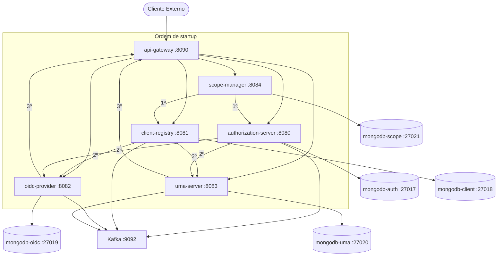
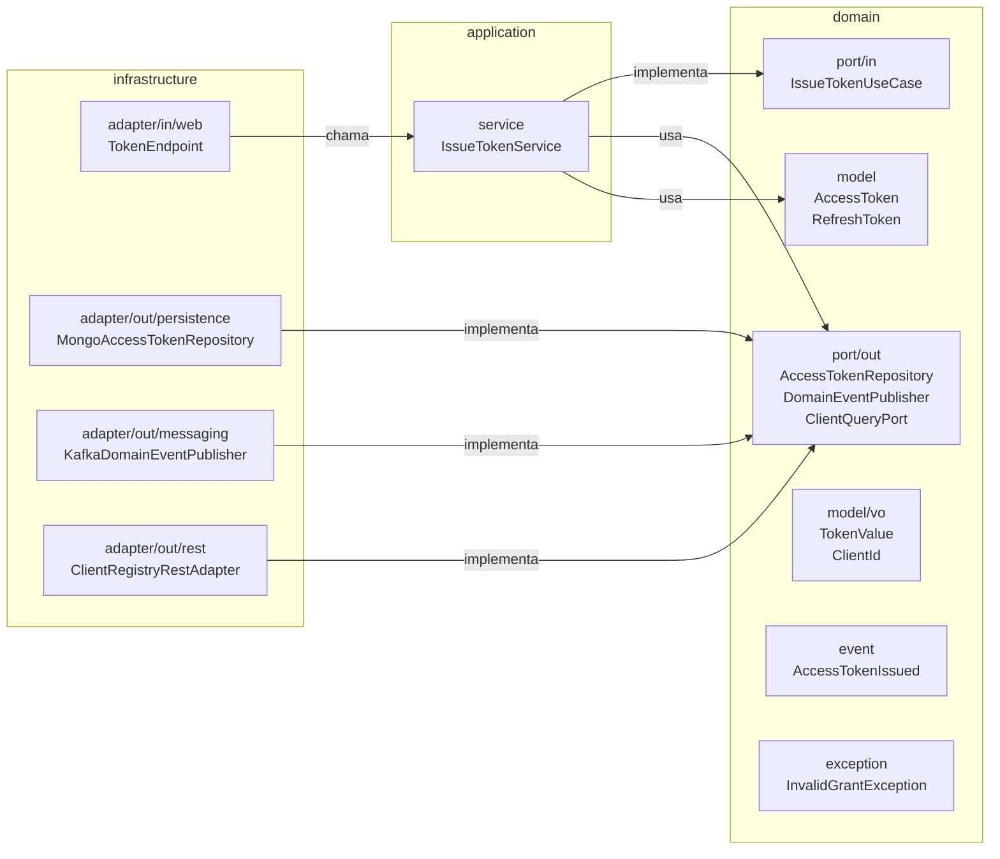

# OIDC/OAuth2/UMA Microservices Platform

## Índice

1. [Visão Geral da Plataforma](#1-visão-geral-da-plataforma)
2. [Como Subir a Plataforma](#2-como-subir-a-plataforma)
3. [Referência de Endpoints](#3-referência-de-endpoints)
4. [Integração de Webapp — Authorization Code + PKCE](#4-integração-de-webapp--authorization-code--pkce)
5. [Integração de Webapp — Client Credentials](#5-integração-de-webapp--client-credentials)
6. [Integração de Webapp — UMA 2.0](#6-integração-de-webapp--uma-20)
7. [Variáveis de Ambiente](#7-variáveis-de-ambiente)
8. [Observabilidade](#8-observabilidade)
9. [Guia para Novos Integrantes](#9-guia-para-novos-integrantes)

---

## 1. Visão Geral da Plataforma

Esta plataforma é uma implementação de referência de microsserviços OIDC/OAuth2/UMA, construída com Domain-Driven Design (DDD) e arquitetura hexagonal (Ports & Adapters). Cada microsserviço é independente, com seu próprio banco de dados MongoDB dedicado, e se comunica de forma assíncrona via Apache Kafka.

Stack principal: **Spring Boot 3**, **MongoDB**, **Kafka** (modo KRaft), orquestrados via **Docker Compose**.

### Microsserviços

| Serviço | Porta | Responsabilidade |
|---|---|---|
| `api-gateway` | 8090 | Roteamento público, ponto de entrada único para todos os clientes externos |
| `authorization-server` | 8080 | Fluxos OAuth 2.0, emissão, revogação e introspecção de tokens |
| `client-registry` | 8081 | Registro dinâmico de clientes OAuth 2.0 (RFC 7591/7592) |
| `oidc-provider` | 8082 | UserInfo, ID Token, Discovery Document e JWKS (OpenID Connect 1.0) |
| `uma-server` | 8083 | UMA 2.0: gerenciamento de ResourceSet, PermissionTicket e RPT |
| `scope-manager` | 8084 | Gerenciamento de SystemScopes da plataforma |
| `migration-tool` | — | Ferramenta run-once para migração de dados relacionais para MongoDB |

### Diagrama de Arquitetura



### Pré-requisitos

- **Docker** 24+
- **Docker Compose** v2.20+
- **Java** 21 + **Maven** 3.9 (para build local dos JARs antes de subir os containers)

---

## 2. Como Subir a Plataforma

### Passos para Subir

1. Clone o repositório e entre no diretório:
   ```bash
   git clone <repo-url> && cd <repo>
   ```

2. Compile todos os módulos e gere os JARs necessários para os Dockerfiles:
   ```bash
   mvn clean package -DskipTests
   ```

3. Construa as imagens e suba todos os containers em background:
   ```bash
   docker-compose up --build -d
   ```

### Comandos de Operação

```bash
# Verificar status dos containers
docker-compose ps

# Parar e remover containers
docker-compose down

# Reconstruir apenas um serviço específico
docker-compose up --build -d <nome-do-serviço>

# Subir a Migration Tool (profile separado)
docker-compose --profile migration up migration-tool
```

### Health Checks

Após subir a plataforma, verifique a saúde de cada microsserviço:

```bash
curl http://localhost:8090/actuator/health  # api-gateway
curl http://localhost:8080/actuator/health  # authorization-server
curl http://localhost:8081/actuator/health  # client-registry
curl http://localhost:8082/actuator/health  # oidc-provider
curl http://localhost:8083/actuator/health  # uma-server
curl http://localhost:8084/actuator/health  # scope-manager
```

### Portas de Infraestrutura

| Serviço | Porta Host |
|---|---|
| `mongodb-auth` | 27017 |
| `mongodb-client` | 27018 |
| `mongodb-oidc` | 27019 |
| `mongodb-uma` | 27020 |
| `mongodb-scope` | 27021 |
| `kafka` | 9092 |


---

## 3. Referência de Endpoints

Todos os endpoints públicos são acessíveis via API Gateway em `http://localhost:8090`. Os exemplos `curl` usam esta base URL. Endpoints que exigem autenticação incluem o header `Authorization: Bearer {access_token}` ou autenticação Basic via `-u client_id:client_secret`.

### 3.1 Authorization Server

#### GET /authorize

Inicia o fluxo Authorization Code. Normalmente acessado via browser redirecionando o usuário.

```bash
# Redirecionar o usuário para a URL de autorização (Authorization Code + PKCE)
GET http://localhost:8090/authorize
  ?response_type=code
  &client_id={client_id}
  &redirect_uri=http://localhost:3000/callback
  &scope=openid%20profile%20email
  &state={random_state}
  &code_challenge={code_challenge}
  &code_challenge_method=S256
```

#### POST /authorize

Submissão do formulário de autorização (usado internamente pelo servidor de autorização ao processar o consentimento do usuário).

```bash
curl -X POST http://localhost:8090/authorize \
  -H "Content-Type: application/x-www-form-urlencoded" \
  -d "response_type=code" \
  -d "client_id={client_id}" \
  -d "redirect_uri=http://localhost:3000/callback" \
  -d "scope=openid profile email" \
  -d "state={random_state}" \
  -d "code_challenge={code_challenge}" \
  -d "code_challenge_method=S256"
```

#### POST /token

**Authorization Code com PKCE:**

```bash
curl -X POST http://localhost:8090/token \
  -H "Content-Type: application/x-www-form-urlencoded" \
  -d "grant_type=authorization_code" \
  -d "code={authorization_code}" \
  -d "redirect_uri=http://localhost:3000/callback" \
  -d "client_id={client_id}" \
  -d "code_verifier={code_verifier}"
```

Resposta:

```json
{
  "access_token": "eyJhbGciOiJSUzI1NiJ9...",
  "token_type": "Bearer",
  "expires_in": 3600,
  "refresh_token": "8xLOxBtZp8",
  "id_token": "eyJhbGciOiJSUzI1NiJ9...",
  "scope": "openid profile email"
}
```

**Client Credentials com Basic auth:**

```bash
curl -X POST http://localhost:8090/token \
  -u "{client_id}:{client_secret}" \
  -H "Content-Type: application/x-www-form-urlencoded" \
  -d "grant_type=client_credentials" \
  -d "scope=read write"
```

Resposta:

```json
{
  "access_token": "eyJhbGciOiJSUzI1NiJ9...",
  "token_type": "Bearer",
  "expires_in": 3600,
  "scope": "read write"
}
```

**Refresh Token:**

```bash
curl -X POST http://localhost:8090/token \
  -H "Content-Type: application/x-www-form-urlencoded" \
  -d "grant_type=refresh_token" \
  -d "refresh_token={refresh_token}" \
  -d "client_id={client_id}"
```

Resposta:

```json
{
  "access_token": "eyJhbGciOiJSUzI1NiJ9...",
  "token_type": "Bearer",
  "expires_in": 3600,
  "refresh_token": "9yMPxCuAq9",
  "scope": "openid profile email"
}
```

#### POST /revoke

Revoga um access token ou refresh token. Requer autenticação Basic com as credenciais do cliente.

```bash
curl -X POST http://localhost:8090/revoke \
  -u "{client_id}:{client_secret}" \
  -H "Content-Type: application/x-www-form-urlencoded" \
  -d "token={access_token_or_refresh_token}"
```

Resposta: `200 OK` (corpo vazio em caso de sucesso).

#### POST /introspect

Inspeciona um token para verificar sua validade e obter seus metadados. Requer autenticação Basic com as credenciais do cliente.

```bash
curl -X POST http://localhost:8090/introspect \
  -u "{client_id}:{client_secret}" \
  -H "Content-Type: application/x-www-form-urlencoded" \
  -d "token={access_token}"
```

Resposta (token ativo):

```json
{
  "active": true,
  "sub": "user123",
  "client_id": "{client_id}",
  "scope": "read write",
  "exp": 1735689600,
  "iat": 1735686000,
  "token_type": "Bearer"
}
```

Resposta (token inativo/expirado):

```json
{
  "active": false
}
```


### 3.2 Client Registry

#### POST /register

Registra um novo cliente OAuth 2.0 dinamicamente (RFC 7591). Não requer autenticação.

```bash
curl -X POST http://localhost:8090/register \
  -H "Content-Type: application/json" \
  -d '{
    "client_name": "My Application",
    "redirect_uris": ["http://localhost:3000/callback"],
    "grant_types": ["authorization_code", "refresh_token"],
    "response_types": ["code"],
    "token_endpoint_auth_method": "client_secret_basic",
    "scope": "openid profile email"
  }'
```

Resposta `201 Created`:

```json
{
  "client_id": "a1b2c3d4-e5f6-7890-abcd-ef1234567890",
  "client_secret": "s3cr3t-v4lu3-g3n3r4t3d-by-s3rv3r",
  "registration_access_token": "reg-token-xyz987",
  "client_name": "My Application",
  "redirect_uris": ["http://localhost:3000/callback"],
  "grant_types": ["authorization_code", "refresh_token"],
  "response_types": ["code"],
  "token_endpoint_auth_method": "client_secret_basic",
  "scope": "openid profile email"
}
```

#### GET /register/{client_id}

Recupera os metadados de um cliente registrado. Requer o `registration_access_token` emitido no momento do registro.

```bash
curl http://localhost:8090/register/{client_id} \
  -H "Authorization: Bearer {registration_access_token}"
```

Resposta `200 OK`:

```json
{
  "client_id": "a1b2c3d4-e5f6-7890-abcd-ef1234567890",
  "client_name": "My Application",
  "redirect_uris": ["http://localhost:3000/callback"],
  "grant_types": ["authorization_code", "refresh_token"],
  "response_types": ["code"],
  "token_endpoint_auth_method": "client_secret_basic",
  "scope": "openid profile email"
}
```

#### PUT /register/{client_id}

Atualiza os metadados de um cliente registrado. Requer o `registration_access_token`. O corpo deve conter todos os campos do cliente (substituição completa).

```bash
curl -X PUT http://localhost:8090/register/{client_id} \
  -H "Authorization: Bearer {registration_access_token}" \
  -H "Content-Type: application/json" \
  -d '{
    "client_name": "My Application (Updated)",
    "redirect_uris": ["http://localhost:3000/callback", "http://localhost:3000/silent-renew"],
    "grant_types": ["authorization_code", "refresh_token"],
    "response_types": ["code"],
    "token_endpoint_auth_method": "client_secret_basic",
    "scope": "openid profile email read"
  }'
```

Resposta `200 OK`:

```json
{
  "client_id": "a1b2c3d4-e5f6-7890-abcd-ef1234567890",
  "client_name": "My Application (Updated)",
  "redirect_uris": ["http://localhost:3000/callback", "http://localhost:3000/silent-renew"],
  "grant_types": ["authorization_code", "refresh_token"],
  "response_types": ["code"],
  "token_endpoint_auth_method": "client_secret_basic",
  "scope": "openid profile email read"
}
```

#### DELETE /register/{client_id}

Remove o registro de um cliente. Requer o `registration_access_token`.

```bash
curl -X DELETE http://localhost:8090/register/{client_id} \
  -H "Authorization: Bearer {registration_access_token}"
```

Resposta: `204 No Content` (corpo vazio em caso de sucesso).


### 3.3 OIDC Provider

#### GET /userinfo

Retorna as claims de identidade do usuário autenticado. Requer um access token com escopo `openid`.

```bash
curl http://localhost:8090/userinfo \
  -H "Authorization: Bearer {access_token}"
```

Resposta `200 OK`:

```json
{
  "sub": "user123",
  "name": "João Silva",
  "given_name": "João",
  "family_name": "Silva",
  "email": "joao.silva@example.com",
  "email_verified": true,
  "picture": "https://example.com/avatar/user123.jpg"
}
```

#### GET /.well-known/openid-configuration

Retorna o discovery document do OpenID Connect, descrevendo os endpoints e capacidades do provedor. Não requer autenticação.

```bash
curl http://localhost:8090/.well-known/openid-configuration
```

Resposta `200 OK`:

```json
{
  "issuer": "http://localhost:8090",
  "authorization_endpoint": "http://localhost:8090/authorize",
  "token_endpoint": "http://localhost:8090/token",
  "userinfo_endpoint": "http://localhost:8090/userinfo",
  "jwks_uri": "http://localhost:8090/jwks",
  "registration_endpoint": "http://localhost:8090/register",
  "scopes_supported": ["openid", "profile", "email", "read", "write"],
  "response_types_supported": ["code"],
  "grant_types_supported": ["authorization_code", "client_credentials", "refresh_token", "urn:ietf:params:oauth:grant-type:uma-ticket"],
  "subject_types_supported": ["public"],
  "id_token_signing_alg_values_supported": ["RS256"],
  "token_endpoint_auth_methods_supported": ["client_secret_basic", "none"],
  "claims_supported": ["sub", "name", "given_name", "family_name", "email", "email_verified", "picture"],
  "code_challenge_methods_supported": ["S256"]
}
```

#### GET /jwks

Retorna o conjunto de chaves públicas JSON Web Key Set (JWKS) usado para verificar assinaturas de tokens JWT. Não requer autenticação.

```bash
curl http://localhost:8090/jwks
```

Resposta `200 OK`:

```json
{
  "keys": [
    {
      "kty": "RSA",
      "use": "sig",
      "kid": "rsa-key-1",
      "alg": "RS256",
      "n": "0vx7agoebGcQSuuPiLJXZptN9nndrQmbXEps2aiAFbWhM78LhWx4cbbfAAt...",
      "e": "AQAB"
    }
  ]
}
```


### 3.4 UMA Server

#### POST /uma/resource_set

Registra um novo ResourceSet no servidor UMA. Requer um Bearer token do Resource Owner.

```bash
curl -X POST http://localhost:8090/uma/resource_set \
  -H "Authorization: Bearer {resource_owner_token}" \
  -H "Content-Type: application/json" \
  -d '{
    "name": "My Photos",
    "uri": "https://photos.example.com/album/1",
    "type": "http://www.example.com/rsrcs/photoalbum",
    "resource_scopes": ["read", "write"],
    "icon_uri": "https://photos.example.com/icon.png"
  }'
```

Resposta `201 Created`:

```json
{
  "_id": "7b727369-c3b2-4b09-857c-cc909414e17b",
  "user_access_policy_uri": "http://localhost:8090/uma/policy/7b727369-c3b2-4b09-857c-cc909414e17b"
}
```

#### GET /uma/resource_set/{id}

Recupera os metadados de um ResourceSet pelo seu identificador. Requer Bearer token do Resource Owner.

```bash
curl http://localhost:8090/uma/resource_set/{id} \
  -H "Authorization: Bearer {resource_owner_token}"
```

Resposta `200 OK`:

```json
{
  "_id": "7b727369-c3b2-4b09-857c-cc909414e17b",
  "name": "My Photos",
  "uri": "https://photos.example.com/album/1",
  "type": "http://www.example.com/rsrcs/photoalbum",
  "resource_scopes": ["read", "write"],
  "icon_uri": "https://photos.example.com/icon.png"
}
```

#### PUT /uma/resource_set/{id}

Atualiza os metadados de um ResourceSet existente. Requer Bearer token do Resource Owner.

```bash
curl -X PUT http://localhost:8090/uma/resource_set/{id} \
  -H "Authorization: Bearer {resource_owner_token}" \
  -H "Content-Type: application/json" \
  -d '{
    "name": "My Photos (Updated)",
    "uri": "https://photos.example.com/album/1",
    "type": "http://www.example.com/rsrcs/photoalbum",
    "resource_scopes": ["read", "write", "delete"],
    "icon_uri": "https://photos.example.com/icon.png"
  }'
```

Resposta `200 OK`:

```json
{
  "_id": "7b727369-c3b2-4b09-857c-cc909414e17b",
  "name": "My Photos (Updated)",
  "uri": "https://photos.example.com/album/1",
  "type": "http://www.example.com/rsrcs/photoalbum",
  "resource_scopes": ["read", "write", "delete"],
  "icon_uri": "https://photos.example.com/icon.png"
}
```

#### DELETE /uma/resource_set/{id}

Remove um ResourceSet registrado. Requer Bearer token do Resource Owner.

```bash
curl -X DELETE http://localhost:8090/uma/resource_set/{id} \
  -H "Authorization: Bearer {resource_owner_token}"
```

Resposta: `204 No Content` (corpo vazio em caso de sucesso).

#### POST /uma/permission

Cria um PermissionTicket para um ResourceSet. Usado pelo Resource Server ao receber uma requisição sem token adequado. Requer Bearer token do Resource Server.

```bash
curl -X POST http://localhost:8090/uma/permission \
  -H "Authorization: Bearer {resource_server_token}" \
  -H "Content-Type: application/json" \
  -d '{
    "resource_id": "{resource_set_id}",
    "resource_scopes": ["read"]
  }'
```

Resposta `201 Created`:

```json
{
  "ticket": "016f84e8-f9b5-11e0-bd6f-0021cc6004de"
}
```


### 3.5 Scope Manager

#### GET /scopes

Lista todos os escopos do sistema. Não requer autenticação.

```bash
curl http://localhost:8090/scopes
```

Resposta `200 OK`:

```json
[
  {
    "value": "openid",
    "description": "OpenID Connect scope",
    "defaultScope": true,
    "restricted": false
  },
  {
    "value": "profile",
    "description": "Access to user profile information",
    "defaultScope": true,
    "restricted": false
  },
  {
    "value": "email",
    "description": "Access to user email address",
    "defaultScope": false,
    "restricted": false
  },
  {
    "value": "read",
    "description": "Read access to protected resources",
    "defaultScope": false,
    "restricted": false
  }
]
```

#### GET /scopes/defaults

Lista apenas os escopos marcados como padrão (`defaultScope: true`). Não requer autenticação.

```bash
curl http://localhost:8090/scopes/defaults
```

Resposta `200 OK`:

```json
[
  {
    "value": "openid",
    "description": "OpenID Connect scope",
    "defaultScope": true,
    "restricted": false
  },
  {
    "value": "profile",
    "description": "Access to user profile information",
    "defaultScope": true,
    "restricted": false
  }
]
```

#### POST /scopes

Cria um novo escopo no sistema. Requer autenticação Bearer.

```bash
curl -X POST http://localhost:8090/scopes \
  -H "Authorization: Bearer {access_token}" \
  -H "Content-Type: application/json" \
  -d '{
    "value": "write",
    "description": "Write access to protected resources",
    "defaultScope": false,
    "restricted": false
  }'
```

Resposta `201 Created`:

```json
{
  "value": "write",
  "description": "Write access to protected resources",
  "defaultScope": false,
  "restricted": false
}
```

#### PUT /scopes/{value}

Atualiza os metadados de um escopo existente. Requer autenticação Bearer.

```bash
curl -X PUT http://localhost:8090/scopes/write \
  -H "Authorization: Bearer {access_token}" \
  -H "Content-Type: application/json" \
  -d '{
    "value": "write",
    "description": "Write and update access to protected resources",
    "defaultScope": false,
    "restricted": true
  }'
```

Resposta `200 OK`:

```json
{
  "value": "write",
  "description": "Write and update access to protected resources",
  "defaultScope": false,
  "restricted": true
}
```

#### DELETE /scopes/{value}

Remove um escopo do sistema. Requer autenticação Bearer.

```bash
curl -X DELETE http://localhost:8090/scopes/write \
  -H "Authorization: Bearer {access_token}"
```

Resposta: `204 No Content` (corpo vazio em caso de sucesso).


---

## 4. Integração de Webapp — Authorization Code + PKCE

Este guia apresenta o fluxo completo de autenticação para aplicações web públicas (SPA/mobile) usando Authorization Code com PKCE (Proof Key for Code Exchange, RFC 7636). Este fluxo não exige armazenar segredos de cliente no frontend.

### Passo 1 — Registrar o cliente público

Registre sua aplicação como cliente público, informando `token_endpoint_auth_method: "none"` (sem segredo de cliente):

```bash
curl -X POST http://localhost:8090/register \
  -H "Content-Type: application/json" \
  -d '{
    "client_name": "My SPA",
    "redirect_uris": ["http://localhost:3000/callback"],
    "grant_types": ["authorization_code", "refresh_token"],
    "response_types": ["code"],
    "token_endpoint_auth_method": "none",
    "scope": "openid profile email"
  }'
```

Guarde o `client_id` retornado na resposta — ele será usado em todos os passos seguintes.

### Passo 2 — Gerar `code_verifier` e `code_challenge`

No frontend, gere o par PKCE usando a Web Crypto API do browser:

```javascript
// Gerar code_verifier (43-128 chars, URL-safe)
const array = new Uint8Array(32);
crypto.getRandomValues(array);
const codeVerifier = btoa(String.fromCharCode(...array))
  .replace(/\+/g, '-').replace(/\//g, '_').replace(/=/g, '');

// Gerar code_challenge (SHA-256 + Base64URL)
const encoder = new TextEncoder();
const data = encoder.encode(codeVerifier);
const digest = await crypto.subtle.digest('SHA-256', data);
const codeChallenge = btoa(String.fromCharCode(...new Uint8Array(digest)))
  .replace(/\+/g, '-').replace(/\//g, '_').replace(/=/g, '');
```

Armazene o `codeVerifier` temporariamente (ex: `sessionStorage`) — ele será necessário no Passo 4.

### Passo 3 — Construir a URL de autorização

Redirecione o usuário para a URL de autorização com todos os parâmetros PKCE:

```
http://localhost:8090/authorize
  ?response_type=code
  &client_id={client_id}
  &redirect_uri=http://localhost:3000/callback
  &scope=openid%20profile%20email
  &state={random_state}
  &code_challenge={code_challenge}
  &code_challenge_method=S256
```

O parâmetro `state` deve ser um valor aleatório gerado por você para proteção contra CSRF. Após o usuário autenticar e consentir, o servidor redireciona para `redirect_uri` com o `code` e o `state` como query parameters.

### Passo 4 — Trocar o `authorization_code` pelo token

Com o `code` recebido no callback, troque-o pelo access token enviando o `code_verifier`:

```bash
curl -X POST http://localhost:8090/token \
  -H "Content-Type: application/x-www-form-urlencoded" \
  -d "grant_type=authorization_code" \
  -d "code={authorization_code}" \
  -d "redirect_uri=http://localhost:3000/callback" \
  -d "client_id={client_id}" \
  -d "code_verifier={code_verifier}"
```

Resposta:

```json
{
  "access_token": "eyJhbGciOiJSUzI1NiJ9...",
  "token_type": "Bearer",
  "expires_in": 3600,
  "refresh_token": "8xLOxBtZp8",
  "id_token": "eyJhbGciOiJSUzI1NiJ9...",
  "scope": "openid profile email"
}
```

### Passo 5 — Chamar o `/userinfo`

Use o `access_token` para obter as claims de identidade do usuário autenticado:

```bash
curl http://localhost:8090/userinfo \
  -H "Authorization: Bearer {access_token}"
```

Resposta:

```json
{
  "sub": "user123",
  "name": "João Silva",
  "given_name": "João",
  "family_name": "Silva",
  "email": "joao.silva@example.com",
  "email_verified": true
}
```

### Passo 6 — Renovar o token via `refresh_token`

Quando o `access_token` expirar, renove-o sem exigir nova autenticação do usuário:

```bash
curl -X POST http://localhost:8090/token \
  -H "Content-Type: application/x-www-form-urlencoded" \
  -d "grant_type=refresh_token" \
  -d "refresh_token={refresh_token}" \
  -d "client_id={client_id}"
```

Resposta:

```json
{
  "access_token": "eyJhbGciOiJSUzI1NiJ9...",
  "token_type": "Bearer",
  "expires_in": 3600,
  "refresh_token": "9yMPxCuAq9",
  "scope": "openid profile email"
}
```


---

## 5. Integração de Webapp — Client Credentials

Este guia apresenta o fluxo Client Credentials para autenticação backend-to-backend, onde não há interação do usuário. Ideal para serviços que precisam se comunicar entre si de forma segura.

### Passo 1 — Registrar o cliente confidencial

Registre seu serviço backend como cliente confidencial, informando `token_endpoint_auth_method: "client_secret_basic"`:

```bash
curl -X POST http://localhost:8090/register \
  -H "Content-Type: application/json" \
  -d '{
    "client_name": "My Backend Service",
    "grant_types": ["client_credentials"],
    "token_endpoint_auth_method": "client_secret_basic",
    "scope": "read write"
  }'
```

Guarde o `client_id` e o `client_secret` retornados na resposta — eles serão usados para autenticação Basic nos passos seguintes.

### Passo 2 — Obter o `access_token`

Solicite um access token usando autenticação Basic (`-u client_id:client_secret`) e informe os escopos desejados:

```bash
curl -X POST http://localhost:8090/token \
  -u "{client_id}:{client_secret}" \
  -H "Content-Type: application/x-www-form-urlencoded" \
  -d "grant_type=client_credentials" \
  -d "scope=read write"
```

Resposta:

```json
{
  "access_token": "eyJhbGciOiJSUzI1NiJ9...",
  "token_type": "Bearer",
  "expires_in": 3600,
  "scope": "read write"
}
```

### Passo 3 — Introspectar o token em APIs protegidas

Use o `access_token` para verificar sua validade e obter seus metadados via `POST /introspect`, também com autenticação Basic:

```bash
curl -X POST http://localhost:8090/introspect \
  -u "{client_id}:{client_secret}" \
  -H "Content-Type: application/x-www-form-urlencoded" \
  -d "token={access_token}"
```

Resposta (token ativo):

```json
{
  "active": true,
  "sub": "{client_id}",
  "client_id": "{client_id}",
  "scope": "read write",
  "exp": 1735689600,
  "iat": 1735686000,
  "token_type": "Bearer"
}
```


---

## 6. Integração de Webapp — UMA 2.0

Este guia apresenta o fluxo completo de autorização delegada usando UMA 2.0 (User-Managed Access), onde o Resource Owner controla quem pode acessar seus recursos.

### Papéis

- **Resource Owner** — usuário que possui os recursos
- **Resource Server** — serviço que hospeda os recursos protegidos
- **Requesting Party** — usuário ou serviço que solicita acesso
- **Authorization Server** — emite tokens e gerencia políticas

### Passo 1 — Registrar o ResourceSet (Resource Server)

O Resource Server registra o recurso protegido no Authorization Server usando o token do Resource Owner:

```bash
curl -X POST http://localhost:8090/uma/resource_set \
  -H "Authorization: Bearer {resource_owner_token}" \
  -H "Content-Type: application/json" \
  -d '{
    "name": "My Photos",
    "uri": "https://photos.example.com/album/1",
    "type": "http://www.example.com/rsrcs/photoalbum",
    "resource_scopes": ["read", "write"],
    "icon_uri": "https://photos.example.com/icon.png"
  }'
# Resposta: { "_id": "7b727369-...", "user_access_policy_uri": "..." }
```

Guarde o `_id` retornado — ele é o `resource_set_id` usado nos passos seguintes.

### Passo 2 — Criar PermissionTicket (Resource Server)

Quando o Resource Server recebe uma requisição sem token adequado, ele solicita um PermissionTicket ao Authorization Server:

```bash
curl -X POST http://localhost:8090/uma/permission \
  -H "Authorization: Bearer {resource_server_token}" \
  -H "Content-Type: application/json" \
  -d '{
    "resource_id": "{resource_set_id}",
    "resource_scopes": ["read"]
  }'
# Resposta: { "ticket": "016f84e8-..." }
```

O Resource Server retorna o ticket ao Requesting Party via header `WWW-Authenticate` para que ele possa obter o RPT.

### Passo 3 — Obter o RPT (Requesting Party)

O Requesting Party usa o ticket para obter um Requesting Party Token (RPT) via `POST /token`:

```bash
curl -X POST http://localhost:8090/token \
  -u "{client_id}:{client_secret}" \
  -H "Content-Type: application/x-www-form-urlencoded" \
  -d "grant_type=urn:ietf:params:oauth:grant-type:uma-ticket" \
  -d "ticket={permission_ticket}"
```

### Passo 4 — Validar o RPT (Resource Server)

O Resource Server valida o RPT via `POST /introspect` antes de conceder acesso ao recurso:

```bash
curl -X POST http://localhost:8090/introspect \
  -u "{client_id}:{client_secret}" \
  -H "Content-Type: application/x-www-form-urlencoded" \
  -d "token={rpt}"
```

Se `active: true` na resposta, o acesso é concedido. Caso contrário, o acesso é negado.


---

## 7. Variáveis de Ambiente

Esta seção lista as variáveis de ambiente de cada microsserviço com seus valores padrão conforme definidos no `docker-compose.yml`.

### 7.1 Authorization Server

| Variável | Descrição | Padrão | Obrigatória |
|---|---|---|---|
| `MONGODB_URI` | URI de conexão MongoDB | `mongodb://mongodb-auth:27017/auth_db` | Sim |
| `KAFKA_BOOTSTRAP_SERVERS` | Endereço do broker Kafka | `kafka:9092` | Sim |
| `SERVER_PORT` | Porta HTTP do serviço | `8080` | Sim |
| `SCOPE_MANAGER_URL` | URL base do scope-manager | `http://scope-manager:8084` | Sim |
| `CLIENT_REGISTRY_URL` | URL base do client-registry | `http://client-registry:8081` | Sim |

### 7.2 Client Registry

| Variável | Descrição | Padrão | Obrigatória |
|---|---|---|---|
| `MONGODB_URI` | URI de conexão MongoDB | `mongodb://mongodb-client:27017/client_db` | Sim |
| `KAFKA_BOOTSTRAP_SERVERS` | Endereço do broker Kafka | `kafka:9092` | Sim |
| `SERVER_PORT` | Porta HTTP do serviço | `8081` | Sim |
| `SCOPE_MANAGER_URL` | URL base do scope-manager | `http://scope-manager:8084` | Sim |

### 7.3 OIDC Provider

| Variável | Descrição | Padrão | Obrigatória |
|---|---|---|---|
| `MONGODB_URI` | URI de conexão MongoDB | `mongodb://mongodb-oidc:27017/oidc_db` | Sim |
| `KAFKA_BOOTSTRAP_SERVERS` | Endereço do broker Kafka | `kafka:9092` | Sim |
| `SERVER_PORT` | Porta HTTP do serviço | `8082` | Sim |
| `AUTHORIZATION_SERVER_URL` | URL do authorization-server | `http://authorization-server:8080` | Sim |

### 7.4 UMA Server

| Variável | Descrição | Padrão | Obrigatória |
|---|---|---|---|
| `MONGODB_URI` | URI de conexão MongoDB | `mongodb://mongodb-uma:27017/uma_db` | Sim |
| `KAFKA_BOOTSTRAP_SERVERS` | Endereço do broker Kafka | `kafka:9092` | Sim |
| `SERVER_PORT` | Porta HTTP do serviço | `8083` | Sim |

### 7.5 Scope Manager

| Variável | Descrição | Padrão | Obrigatória |
|---|---|---|---|
| `MONGODB_URI` | URI de conexão MongoDB | `mongodb://mongodb-scope:27017/scope_db` | Sim |
| `SERVER_PORT` | Porta HTTP do serviço | `8084` | Sim |

### 7.6 API Gateway

| Variável | Descrição | Padrão | Obrigatória |
|---|---|---|---|
| `SERVER_PORT` | Porta HTTP do gateway | `8090` | Sim |
| `AUTHORIZATION_SERVER_URL` | URL do authorization-server | `http://authorization-server:8080` | Sim |
| `CLIENT_REGISTRY_URL` | URL do client-registry | `http://client-registry:8081` | Sim |
| `OIDC_PROVIDER_URL` | URL do oidc-provider | `http://oidc-provider:8082` | Sim |
| `UMA_SERVER_URL` | URL do uma-server | `http://uma-server:8083` | Sim |
| `SCOPE_MANAGER_URL` | URL do scope-manager | `http://scope-manager:8084` | Sim |

### 7.7 Migration Tool

| Variável | Descrição | Padrão | Obrigatória |
|---|---|---|---|
| `MONGODB_AUTH_URI` | URI MongoDB do authorization-server | `mongodb://mongodb-auth:27017/auth_db` | Sim |
| `MONGODB_CLIENT_URI` | URI MongoDB do client-registry | `mongodb://mongodb-client:27017/client_db` | Sim |
| `MONGODB_OIDC_URI` | URI MongoDB do oidc-provider | `mongodb://mongodb-oidc:27017/oidc_db` | Sim |
| `MONGODB_UMA_URI` | URI MongoDB do uma-server | `mongodb://mongodb-uma:27017/uma_db` | Sim |
| `MONGODB_SCOPE_URI` | URI MongoDB do scope-manager | `mongodb://mongodb-scope:27017/scope_db` | Sim |

---

## 8. Observabilidade

### Endpoints Actuator

Todos os microsserviços expõem os seguintes endpoints de observabilidade via Spring Boot Actuator:

| Endpoint | Descrição |
|---|---|
| `GET /actuator/health` | Status de saúde do serviço e dependências |
| `GET /actuator/metrics` | Métricas no formato Micrometer |
| `GET /actuator/info` | Informações de build e versão |

### Formato de Logs Estruturados

Os microsserviços emitem logs em formato JSON estruturado. Cada linha de log contém os seguintes campos:

```json
{
  "timestamp": "2024-01-01T00:00:00.000Z",
  "level": "INFO",
  "service": "authorization-server",
  "traceId": "4bf92f3577b34da6a3ce929d0e0e4736",
  "spanId": "00f067aa0ba902b7",
  "message": "Token issued for client my-client"
}
```

### Métricas Prometheus

As métricas estão disponíveis no formato Prometheus via `/actuator/prometheus`. Exemplo de configuração de scrape para coletar métricas de todos os microsserviços:

```yaml
scrape_configs:
  - job_name: 'oidc-platform'
    metrics_path: '/actuator/prometheus'
    static_configs:
      - targets:
          - 'localhost:8080'  # authorization-server
          - 'localhost:8081'  # client-registry
          - 'localhost:8082'  # oidc-provider
          - 'localhost:8083'  # uma-server
          - 'localhost:8084'  # scope-manager
          - 'localhost:8090'  # api-gateway
```

### Script de Health Check

Para verificar a saúde de todos os serviços de uma vez, use o script abaixo:

```bash
#!/bin/bash
SERVICES=(
  "api-gateway:8090"
  "authorization-server:8080"
  "client-registry:8081"
  "oidc-provider:8082"
  "uma-server:8083"
  "scope-manager:8084"
)

for entry in "${SERVICES[@]}"; do
  name="${entry%%:*}"
  port="${entry##*:}"
  status=$(curl -s -o /dev/null -w "%{http_code}" \
    "http://localhost:${port}/actuator/health")
  echo "${name}: HTTP ${status}"
done
```

---

## 9. Guia para Novos Integrantes

### 9.1 Arquitetura Hexagonal (Ports & Adapters)

Esta subseção explica o padrão arquitetural adotado em todos os microsserviços da plataforma.

**As três camadas:**

- **`domain`** — núcleo de negócio puro. Contém entidades, value objects, eventos, exceções e interfaces de porta (`port/in`, `port/out`). Não possui nenhuma dependência de framework (sem Spring, sem MongoDB, sem Kafka). É a camada mais interna e estável.
- **`application`** — orquestração de casos de uso. Contém as implementações das interfaces `port/in` definidas no domínio (`application/service/`). Coordena chamadas ao domínio e às portas de saída. Pode depender do `domain`, mas não de `infrastructure`.
- **`infrastructure`** — adaptadores de entrada e saída. Contém os controllers REST (`adapter/in/web/`), repositórios MongoDB (`adapter/out/persistence/`), publishers Kafka (`adapter/out/messaging/`), clientes HTTP (`adapter/out/rest/`) e configurações Spring (`config/`). Implementa as interfaces `port/out` definidas no domínio.

**Diagrama de fluxo de dependência:**



**Regra de dependência:** camadas externas dependem de camadas internas, nunca o contrário. O `domain` não conhece nenhuma tecnologia de infraestrutura. A `infrastructure` depende do `domain` (via interfaces `port/out`). A `application` depende do `domain` (via interfaces `port/in` e `port/out`). Isso garante que o núcleo de negócio pode ser testado isoladamente, sem necessidade de Spring, MongoDB ou Kafka.

---

### 9.2 Organização DDD de Cada Microsserviço

Cada microsserviço organiza seu código em subpacotes dentro de `domain/` com propósitos bem definidos. Os exemplos abaixo usam o `authorization-server` como referência.

**`domain/model/`** — entidades e agregados do domínio. São POJOs sem anotações de framework.
- Exemplos: `AccessToken`, `RefreshToken`, `AuthorizationCode`

**`domain/model/vo/`** — Value Objects imutáveis que encapsulam conceitos do domínio com validação própria.
- Exemplos: `ClientId`, `TokenValue`, `PKCEChallenge`, `Scope`

**`domain/port/in/`** — interfaces de casos de uso. Cada interface representa uma intenção de negócio e é implementada por `application/service/`.
- Exemplos: `IssueTokenUseCase`, `RevokeTokenUseCase`, `IntrospectTokenUseCase`

**`domain/port/out/`** — interfaces de saída do domínio. Abstraem persistência e comunicação externa, implementadas por `infrastructure/adapter/out/`.
- Exemplos: `AccessTokenRepository`, `DomainEventPublisher`, `ClientQueryPort`, `ScopeQueryPort`

**`domain/event/`** — eventos de domínio publicados após operações relevantes, enviados ao Kafka via `KafkaDomainEventPublisher`.
- Exemplos: `AccessTokenIssued`, `AccessTokenRevoked`, `RefreshTokenIssued`

**`domain/exception/`** — exceções tipadas que representam violações de regras de negócio. Estendem `DomainException` e são mapeadas para respostas HTTP pelo `GlobalExceptionHandler`.
- Exemplos: `InvalidGrantException`, `ClientNotFoundException`, `InvalidScopeException`

**`application/service/`** — implementações dos casos de uso definidos em `domain/port/in/`. Orquestram chamadas ao domínio e às portas de saída.
- Exemplos: `IssueTokenService`, `RevokeTokenService`, `IntrospectTokenService`

---

### 9.3 Estrutura de Pacotes Padrão — `authorization-server` como Exemplo Canônico

Ao criar ou navegar em qualquer microsserviço, a estrutura de pacotes segue este padrão. O `authorization-server` é o exemplo mais completo:

```
authorization-server/
└── src/
    ├── main/
    │   ├── java/
    │   │   └── com/example/authserver/
    │   │       ├── domain/
    │   │       │   ├── model/
    │   │       │   │   ├── AccessToken.java
    │   │       │   │   ├── RefreshToken.java
    │   │       │   │   ├── AuthorizationCode.java
    │   │       │   │   └── vo/
    │   │       │   │       ├── TokenValue.java
    │   │       │   │       ├── ClientId.java
    │   │       │   │       ├── PKCEChallenge.java
    │   │       │   │       └── Scope.java
    │   │       │   ├── port/
    │   │       │   │   ├── in/
    │   │       │   │   │   ├── IssueTokenUseCase.java
    │   │       │   │   │   ├── RevokeTokenUseCase.java
    │   │       │   │   │   └── IntrospectTokenUseCase.java
    │   │       │   │   └── out/
    │   │       │   │       ├── AccessTokenRepository.java
    │   │       │   │       ├── RefreshTokenRepository.java
    │   │       │   │       ├── DomainEventPublisher.java
    │   │       │   │       ├── ClientQueryPort.java
    │   │       │   │       └── ScopeQueryPort.java
    │   │       │   ├── event/
    │   │       │   │   ├── AccessTokenIssued.java
    │   │       │   │   ├── AccessTokenRevoked.java
    │   │       │   │   └── RefreshTokenIssued.java
    │   │       │   └── exception/
    │   │       │       ├── DomainException.java
    │   │       │       ├── InvalidGrantException.java
    │   │       │       ├── ClientNotFoundException.java
    │   │       │       └── InvalidScopeException.java
    │   │       ├── application/
    │   │       │   └── service/
    │   │       │       ├── IssueTokenService.java
    │   │       │       ├── RevokeTokenService.java
    │   │       │       └── IntrospectTokenService.java
    │   │       └── infrastructure/
    │   │           ├── adapter/
    │   │           │   ├── in/
    │   │           │   │   └── web/
    │   │           │   │       ├── TokenEndpoint.java
    │   │           │   │       ├── AuthorizationEndpoint.java
    │   │           │   │       ├── IntrospectionEndpoint.java
    │   │           │   │       ├── RevocationEndpoint.java
    │   │           │   │       └── GlobalExceptionHandler.java
    │   │           │   └── out/
    │   │           │       ├── persistence/
    │   │           │       │   ├── MongoAccessTokenRepository.java
    │   │           │       │   ├── SpringDataAccessTokenRepository.java
    │   │           │       │   ├── MongoRefreshTokenRepository.java
    │   │           │       │   ├── SpringDataRefreshTokenRepository.java
    │   │           │       │   └── document/
    │   │           │       │       ├── AccessTokenDocument.java
    │   │           │       │       └── RefreshTokenDocument.java
    │   │           │       ├── messaging/
    │   │           │       │   └── KafkaDomainEventPublisher.java
    │   │           │       └── rest/
    │   │           │           ├── ClientRegistryRestAdapter.java
    │   │           │           └── ScopeManagerRestAdapter.java
    │   │           └── config/
    │   │               ├── MongoConfig.java
    │   │               ├── KafkaConfig.java
    │   │               ├── SecurityConfig.java
    │   │               └── JwkConfig.java
    │   └── resources/
    │       └── application.yml
    └── test/
        └── java/
            └── com/example/authserver/
                └── (espelha a estrutura de src/main/java)
```

**Convenções de nomenclatura:**
- Adaptadores de persistência: `Mongo{Entidade}Repository` para a implementação, `SpringData{Entidade}Repository` para a interface Spring Data subjacente.
- Documentos MongoDB: `{Entidade}Document` em `persistence/document/`, com anotações `@Document` e mapeamento explícito de/para a entidade de domínio.
- Controllers REST: nomeados pelo endpoint que expõem (ex: `TokenEndpoint`, `AuthorizationEndpoint`), não pelo padrão `*Controller`.

Ao criar um novo microsserviço, replique esta mesma estrutura de pacotes `domain/`, `application/` e `infrastructure/` com os mesmos subpacotes.

---

### 9.4 Convenções e Decisões Arquiteturais

Estas convenções se aplicam a todos os microsserviços da plataforma e devem ser seguidas ao contribuir com código novo.

**Isolamento de dados por microsserviço:** cada microsserviço possui seu próprio banco de dados MongoDB dedicado. Nenhum microsserviço acessa diretamente o banco de dados de outro. A comunicação entre serviços é feita exclusivamente via APIs ou eventos.

**Comunicação assíncrona via Kafka:** eventos de domínio definidos em `domain/event/` são publicados no Kafka pelo `KafkaDomainEventPublisher` (`infrastructure/adapter/out/messaging/`). Outros microsserviços consomem esses eventos para reagir a mudanças de estado sem acoplamento direto.

**Comunicação síncrona via adaptadores REST:** quando um microsserviço precisa consultar outro de forma síncrona (ex: `authorization-server` consultando `client-registry` e `scope-manager`), isso é feito via adaptadores REST em `infrastructure/adapter/out/rest/` (ex: `ClientRegistryRestAdapter`, `ScopeManagerRestAdapter`). Esses adaptadores implementam interfaces de porta de saída definidas no domínio (`ClientQueryPort`, `ScopeQueryPort`), mantendo o domínio desacoplado da tecnologia HTTP.

**Entidades de domínio são POJOs:** as classes em `domain/model/` não possuem anotações de framework (`@Document`, `@Entity`, `@JsonProperty`). O mapeamento para documentos MongoDB é feito nas classes `*Document` em `infrastructure/adapter/out/persistence/document/`, que são responsáveis pela conversão de/para as entidades de domínio.

**Value Objects são imutáveis:** as classes em `domain/model/vo/` possuem campos `final`, sem setters, e encapsulam validação e semântica do conceito que representam. A validação é feita no construtor — um Value Object inválido nunca é criado.

**Exceções de domínio e GlobalExceptionHandler:** exceções em `domain/exception/` estendem a classe base `DomainException`. O `GlobalExceptionHandler` em `infrastructure/adapter/in/web/` captura essas exceções e as mapeia para respostas HTTP com os status codes e corpos de erro apropriados (ex: `InvalidGrantException` → `400 Bad Request`, `ClientNotFoundException` → `404 Not Found`).

**Estrutura Maven:** cada microsserviço é um módulo Maven com `pom.xml` herdando do `pom.xml` pai na raiz do projeto. A estrutura de diretórios segue o padrão Maven: `src/main/java`, `src/main/resources` e `src/test/java`.
